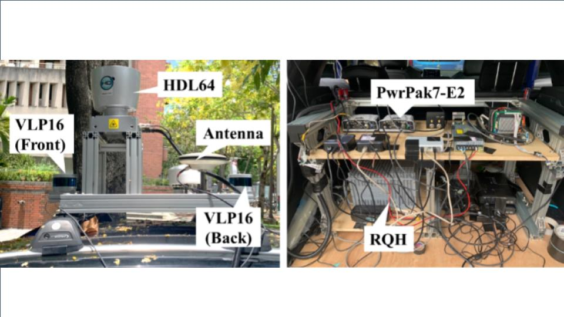
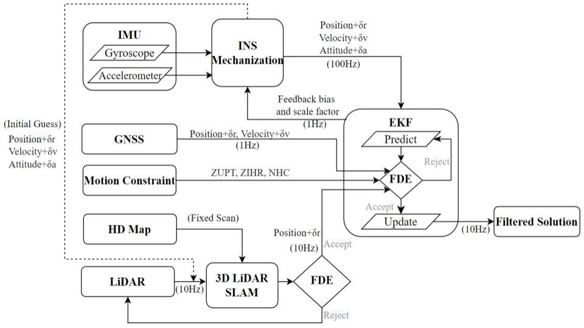

# Ashley Chiu

## Introduction

<!-- TABLE OF CONTENTS -->

  
Table of Contents

  <ol>
    <li>
      <a href="#skills">Skills</a>
    </li>
    <li>
      <a href="#portfolio">Portfolio</a>
    </li>
    <li>
      <a href="#thesis">Thesis</a>
    </li>
    <li>
      <a href="#published_papers">Published Papers</a>
    </li>
    <li>
      <a href="#technical_research_&_deep_dives">Technical Research & Deep Dives</a>
    </li>
    <li>
      <a href="#contact">Contact</a>
    </li>
  </ol>

## Skills
- **Language:** C++, Python, C, Matlab, Bash Scripting
- **Hardware Interfacing & Protocols:** UART, CAN bus, UDS(ISO 14229). Experienced with **LiDAR (Ouster/Velodyne), GNSS/IMU Integration and Temporal Alignment**.
- **Robotics & Computer Vision:** ROS/ROS2 , OpenCV, Eigen, PyTorch.
- **Domain Expertise:**
  - **Sensor Calibration:** Extrinsic, Multi-sensor Spatial-Temporal Synchronization.
  - **Localization:** SLAM (LiDAR), Sensor Fusion (EKF/UKF), Point Cloud Processing (PCL), Factor Graph Optimization.
- **Software Engineering:** Git, Docker, Linux, CI/CD, Unit Testing (GTest/Pytest).
- **Automotive & Diagnostic Tools:** CANoe/CANdb++, Kvaser CanKing, LIN Bus tools.

## Portfolio
### LiDAR Calibration Toolkit  [[link]](https://github.com/ashley17happy17/lidar_eop_calib.git)
- Summary: This toolkit is an automated calibration suite is conduct **extrinsic calibration between LiDARs and GNSS**.
- Key Technology: *Normal Distributions Transform, Direct Georeferencing, Non-linear Least Squares optimization, Network Adjustment*.
- Note: A KNN-based error analysis tool with a visualization interface is provided as well to quantify calibration precision.
- Contribution: Toolkit research and develop 100%. Extrinsic calibration result achieves centimeter-level extrinsic accuracy.

    
    
    

### LiDAR Synchronization and Merge Toolkit  [[link]](https://github.com/ashley17happy17/lidar_sync_merge.git)
- Summary: This toolkit synthesizes multi-LiDAR data through motion compensation and coordinate transformation to generate high-precision fused point clouds for model training.
- Key Technology: *Motion Compensation, Direct Georeferencing, Point Cloud Denoising*.
- Contribution: Toolkit research and develop 100%. Over one hundred-thousand frames of high-precision fused point cloud have been applied for static object model training.

    

### Extended Kalman Filter Based Automotive Dead Reackoning Localization System
- Summary: Implemented an EKF-based ADR module that integrates multi-sensor inputs with kinematic motion constraints, effectively mitigating sensor drift and delivering lane-level positioning reliability for autonomous platforms.
- Key Technology: *GNSS, IMU, Odeometer, Extended Kalman Filter, Non-Holonoic Constraints, Zero Velocity Update, Zero Integrated Heading Rate, Direct Georeferencing, High Definition Map*.
- Contribution: Toolkit research and develop 40%. 
- Note: Due to NDA, the source code is not publicly available. Detailed methodologies can be discussed during the interview.

### Trajectory Position, Velocity, Attitude Evaluation Toolkit  [[link]](https://github.com/ashley17happy17/traj_pva_analysis.git)
- Summary: Developed quantitative analysis tools to benchmark localization errors and systematically evaluate positioning performance.
- Key Technology: *Direct Georeferencing, Coordinate Transformation*.
- Contribution: Toolkit research and develop 100%. Precisely evaluate localization performace by not only north, east, up direction, but also hand out evaluation by along and cross track direction.

    
  

### Transformation Toolkit of evo-trajectory to Global System  [[link]](https://github.com/ashley17happy17/evo_traj_to_global.git)
- Summary: A utility designed to transform localized ego-trajectories from the 'evo' framework into a global coordinate system through geospatial reference alignment and spatial transformation.
- Key Technology: *Direct Georeferencing, Coordinate Transformation*.
- Contribution: Toolkit research and develop 100%. Enhance the trajectory evaluation robustness via displaying in the global coordinate.

    

## Thesis
**Performance Analysis of Multi-Sensor Fusion Engine System Using INS/GNSS/LiDAR Scheme for Land Vehicular Navigation Applications**
- System Architecture: Developed an **INS/GNSS/LiDAR integrated system using EKF** for high-precision PVT (Positioning, Navigation, and Timing). Sensor applied in the thesis is shown at the figure on the left.
- Core Algorithms: Implemented NDT scan matching and EKF-SLAM; engineered dual schemes for both HD-Map-aided and map-less (sliding window) scenarios. Figure on the right demonstrates the architecture of the algorithm.
- Reliability & Integrity: Integrated **Fault Detection and Exclusion (FDE)** to mitigate sensor errors, significantly enhancing height and heading stability.
- Validation & Performance: Conducted simulations via Autoware and real-world testing; achieved "where-in-lane" accuracy (< 0.5m) in GNSS-challenging environments.
- Hardware Analysis: Evaluated the performance impact of different LiDAR grades, optimizing hardware selection for autonomous platforms.
- Keywords: *GNSS, IMU, Odeometer, Extended Kalman Filter, Non-Holonoic Constraints, Zero Velocity Update, Zero Integrated Heading Rate, Direct Georeferencing, High Definition Map, Normal Distributions Transform*.

    
    

## Published Papers
- *Chiang, K., Chiu, Y., Srinara, S., & Tsai, M. (2023). Performance of LiDAR-SLAM-based PNT with initial poses based on NDT scan matching algorithm. Satellite Navigation, 4(1), 1-15.*
- *Srinara, S., & Chiu, Y. T. (2022, September). Adaptive Covariance Estimation of LiDAR based Positioning Error for Multi-Sensor Fusion Scheme with Autonomous Vehicular Navigation System. In Proceedings of the 35th International Technical Meeting of the Satellite Division of The Institute of Navigation (ION GNSS+ 2022) (pp. 1650-1664).*
- *Chiu, Y. T., Srinara, S., Tsai, M. L., & Chiang, K. W. (2022). IMPROVEMENT OF LiDAR-SLAM-BASED 3D NDT LOCALIZATION USING FAULT DETECTION AND EXCLUSION ALGORITHM. International Archives of the Photogrammetry, Remote Sensing & Spatial Information Sciences*
- *Chiu, Y. T., Srinara, S., Chiang, K. W., Naser, E.  (2023) Performance Analysis of Multi-Sensor Fusion Engine System Using INS/GNSS/LiDAR/HD Map Scheme for Autonomous Driving PNT Application. International Symposium on Mobile Mapping Technology (abstract accepted)*

## Technical Research & Deep Dives
Exploring the state-of-art techniques in autonomous driving and software engineering:
- [PIN-SLAM](https://github.com/ashley17happy17/slam/blob/36f6f666002715c99a29bd70e9aed1ebc1c84aad/pin-slam.md)
- [LIO-SAM](https://github.com/ashley17happy17/slam/blob/1f5fd76149b1a2fea1bf859a72db1d68337d843f/lio-sam.md)
- [KISS-ICP](https://github.com/ashley17happy17/slam/blob/36f6f666002715c99a29bd70e9aed1ebc1c84aad/kiss-icp.md)

Notes for LiDAR temporal synchronization hardware/firmware/software settings:
- [ouster](https://github.com/ashley17happy17/io/blob/575af60867f4b1390736307919d017bd3fa593b0/lidar/ouster.md)
- [velodyne](https://github.com/ashley17happy17/io/blob/575af60867f4b1390736307919d017bd3fa593b0/lidar/velodyne.md)

## Contact
- email: happy17happy17happy17@gmail.com
- LinkedIn: www.linkedin.com/in/ashley-ytc
